# Exploratory data analysis in Python.

## Let us understand how to explore the data in python.


Image Credits: Morioh

## Introduction

**What is Exploratory Data Analysis ?**

Exploratory Data Analysis or (EDA) is understanding the data sets by summarizing their main characteristics often plotting them visually. This step is very important especially when we arrive at modeling the data in order to apply Machine learning. Plotting in EDA consists of Histograms, Box plot, Scatter plot and many more. It often takes much time to explore the data. Through the process of EDA, we can ask to define the problem statement or definition on our data set which is very important.

**How to perform Exploratory Data Analysis ?**

This is one such question that everyone is keen on knowing the answer. Well, the answer is it depends on the data set that you are working. There is no one method or common methods in order to perform EDA, whereas in this tutorial you can understand some common methods and plots that would be used in the EDA process.

**What data are we exploring today ?**


Since I am a huge fan of technology, I got a very beautiful data-set of cellphones from Kaggle. The data-set can be downloaded from [here](https://www.kaggle.com/datasets/valakhorasani/mobile-device-usage-and-user-behavior-dataset). To give a piece of brief information about the data set this data contains 700 rows and more than 10 columns which contains findings of the cellular usage as Device Model, Operating System, App Usage Time (min/day), and many more. So in this tutorial, we will explore the data and make it ready for modeling.


---


## 1. Importing the required libraries for EDA

Below are the libraries that are used in order to perform EDA (Exploratory data analysis) in this tutorial.


```python
# import sys
# print(sys.version)
# %pip install seaborn
```


```python
import pandas as pd
import numpy as np
import seaborn as sns                       #visualisation
import matplotlib.pyplot as plt             #visualisation
%matplotlib inline     
sns.set(color_codes=True)
#try to change every chart here, and maybe add some new ones
```


---


## 2. Loading the data into the data frame.

Loading the data into the pandas data frame is certainly one of the most important steps in EDA, as we can see that the value from the data set is comma-separated. So all we have to do is to just read the CSV into a data frame and pandas data frame does the job for us.

To get or load the dataset into the notebook, all I did was one trivial step. In Google Colab at the left-hand side of the notebook, you will find a > (greater than symbol). When you click that you will find a tab with three options, you just have to select Files. Then you can easily upload your file with the help of the Upload option. No need to mount to the google drive or use any specific libraries just upload the data set and your job is done. One thing to remember in this step is that uploaded files will get deleted when this runtime is recycled. This is how I got the data set into the notebook.


```python
df = pd.read_csv("./user_behavior_dataset.csv")
# To display the top 5 rows 
df.head(5)
```


<div>
<style scoped>
    .dataframe tbody tr th:only-of-type {
        vertical-align: middle;
    }

    .dataframe tbody tr th {
        vertical-align: top;
    }

    .dataframe thead th {
        text-align: right;
    }
</style>
<table border="1" class="dataframe">
  <thead>
    <tr style="text-align: right;">
      <th></th>
      <th>User ID</th>
      <th>Device Model</th>
      <th>Operating System</th>
      <th>App Usage Time (min/day)</th>
      <th>Screen On Time (hours/day)</th>
      <th>Battery Drain (mAh/day)</th>
      <th>Number of Apps Installed</th>
      <th>Data Usage (MB/day)</th>
      <th>Age</th>
      <th>Gender</th>
      <th>User Behavior Class</th>
    </tr>
  </thead>
  <tbody>
    <tr>
      <th>0</th>
      <td>1</td>
      <td>Google Pixel 5</td>
      <td>Android</td>
      <td>393</td>
      <td>6.4</td>
      <td>1872</td>
      <td>67</td>
      <td>1122</td>
      <td>40</td>
      <td>Male</td>
      <td>4</td>
    </tr>
    <tr>
      <th>1</th>
      <td>2</td>
      <td>OnePlus 9</td>
      <td>Android</td>
      <td>268</td>
      <td>4.7</td>
      <td>1331</td>
      <td>42</td>
      <td>944</td>
      <td>47</td>
      <td>Female</td>
      <td>3</td>
    </tr>
    <tr>
      <th>2</th>
      <td>3</td>
      <td>Xiaomi Mi 11</td>
      <td>Android</td>
      <td>154</td>
      <td>4.0</td>
      <td>761</td>
      <td>32</td>
      <td>322</td>
      <td>42</td>
      <td>Male</td>
      <td>2</td>
    </tr>
    <tr>
      <th>3</th>
      <td>4</td>
      <td>Google Pixel 5</td>
      <td>Android</td>
      <td>239</td>
      <td>4.8</td>
      <td>1676</td>
      <td>56</td>
      <td>871</td>
      <td>20</td>
      <td>Male</td>
      <td>3</td>
    </tr>
    <tr>
      <th>4</th>
      <td>5</td>
      <td>iPhone 12</td>
      <td>iOS</td>
      <td>187</td>
      <td>4.3</td>
      <td>1367</td>
      <td>58</td>
      <td>988</td>
      <td>31</td>
      <td>Female</td>
      <td>3</td>
    </tr>
  </tbody>
</table>
</div>


```python
df.tail(5)                        # To display the botton 5 rows
```


<div>
<style scoped>
    .dataframe tbody tr th:only-of-type {
        vertical-align: middle;
    }

    .dataframe tbody tr th {
        vertical-align: top;
    }

    .dataframe thead th {
        text-align: right;
    }
</style>
<table border="1" class="dataframe">
  <thead>
    <tr style="text-align: right;">
      <th></th>
      <th>User ID</th>
      <th>Device Model</th>
      <th>Operating System</th>
      <th>App Usage Time (min/day)</th>
      <th>Screen On Time (hours/day)</th>
      <th>Battery Drain (mAh/day)</th>
      <th>Number of Apps Installed</th>
      <th>Data Usage (MB/day)</th>
      <th>Age</th>
      <th>Gender</th>
      <th>User Behavior Class</th>
    </tr>
  </thead>
  <tbody>
    <tr>
      <th>695</th>
      <td>696</td>
      <td>iPhone 12</td>
      <td>iOS</td>
      <td>92</td>
      <td>3.9</td>
      <td>1082</td>
      <td>26</td>
      <td>381</td>
      <td>22</td>
      <td>Male</td>
      <td>2</td>
    </tr>
    <tr>
      <th>696</th>
      <td>697</td>
      <td>Xiaomi Mi 11</td>
      <td>Android</td>
      <td>316</td>
      <td>6.8</td>
      <td>1965</td>
      <td>68</td>
      <td>1201</td>
      <td>59</td>
      <td>Male</td>
      <td>4</td>
    </tr>
    <tr>
      <th>697</th>
      <td>698</td>
      <td>Google Pixel 5</td>
      <td>Android</td>
      <td>99</td>
      <td>3.1</td>
      <td>942</td>
      <td>22</td>
      <td>457</td>
      <td>50</td>
      <td>Female</td>
      <td>2</td>
    </tr>
    <tr>
      <th>698</th>
      <td>699</td>
      <td>Samsung Galaxy S21</td>
      <td>Android</td>
      <td>62</td>
      <td>1.7</td>
      <td>431</td>
      <td>13</td>
      <td>224</td>
      <td>44</td>
      <td>Male</td>
      <td>1</td>
    </tr>
    <tr>
      <th>699</th>
      <td>700</td>
      <td>OnePlus 9</td>
      <td>Android</td>
      <td>212</td>
      <td>5.4</td>
      <td>1306</td>
      <td>49</td>
      <td>828</td>
      <td>23</td>
      <td>Female</td>
      <td>3</td>
    </tr>
  </tbody>
</table>
</div>


---


## 3. Checking the types of data

Here we check for the datatypes because sometimes the integer data could be stored as a string, if in that case, we have to convert that string to the integer data only then we can plot the data via a graph. Here, in this case, the data is already in integer format so nothing to worry.


```python
df.dtypes
```


    User ID                         int64
    Device Model                   object
    Operating System               object
    App Usage Time (min/day)        int64
    Screen On Time (hours/day)    float64
    Battery Drain (mAh/day)         int64
    Number of Apps Installed        int64
    Data Usage (MB/day)             int64
    Age                             int64
    Gender                         object
    User Behavior Class             int64
    dtype: object


---


## 4. Dropping irrelevant columns

This step is certainly needed in every EDA because sometimes there would be many columns that we never use in such cases dropping is the only solution. In this case, the column User ID doesn't make any sense to me so I just dropped for this instance.


```python
# what if we keep some of the columns?
df = df.drop(['User ID'], axis=1)
df.head(5)
```


<div>
<style scoped>
    .dataframe tbody tr th:only-of-type {
        vertical-align: middle;
    }

    .dataframe tbody tr th {
        vertical-align: top;
    }

    .dataframe thead th {
        text-align: right;
    }
</style>
<table border="1" class="dataframe">
  <thead>
    <tr style="text-align: right;">
      <th></th>
      <th>Device Model</th>
      <th>Operating System</th>
      <th>App Usage Time (min/day)</th>
      <th>Screen On Time (hours/day)</th>
      <th>Battery Drain (mAh/day)</th>
      <th>Number of Apps Installed</th>
      <th>Data Usage (MB/day)</th>
      <th>Age</th>
      <th>Gender</th>
      <th>User Behavior Class</th>
    </tr>
  </thead>
  <tbody>
    <tr>
      <th>0</th>
      <td>Google Pixel 5</td>
      <td>Android</td>
      <td>393</td>
      <td>6.4</td>
      <td>1872</td>
      <td>67</td>
      <td>1122</td>
      <td>40</td>
      <td>Male</td>
      <td>4</td>
    </tr>
    <tr>
      <th>1</th>
      <td>OnePlus 9</td>
      <td>Android</td>
      <td>268</td>
      <td>4.7</td>
      <td>1331</td>
      <td>42</td>
      <td>944</td>
      <td>47</td>
      <td>Female</td>
      <td>3</td>
    </tr>
    <tr>
      <th>2</th>
      <td>Xiaomi Mi 11</td>
      <td>Android</td>
      <td>154</td>
      <td>4.0</td>
      <td>761</td>
      <td>32</td>
      <td>322</td>
      <td>42</td>
      <td>Male</td>
      <td>2</td>
    </tr>
    <tr>
      <th>3</th>
      <td>Google Pixel 5</td>
      <td>Android</td>
      <td>239</td>
      <td>4.8</td>
      <td>1676</td>
      <td>56</td>
      <td>871</td>
      <td>20</td>
      <td>Male</td>
      <td>3</td>
    </tr>
    <tr>
      <th>4</th>
      <td>iPhone 12</td>
      <td>iOS</td>
      <td>187</td>
      <td>4.3</td>
      <td>1367</td>
      <td>58</td>
      <td>988</td>
      <td>31</td>
      <td>Female</td>
      <td>3</td>
    </tr>
  </tbody>
</table>
</div>


---


## 5. Renaming the columns

In this instance, most of the column names are very confusing to read, so I just tweaked their column names. This is a good approach it improves the readability of the data set.


```python
df = df.rename(columns={"Device Model": "Model", "Operating System": "OS", "App Usage Time (min/day)": "Apps (min/day)", "Screen On Time (hours/day)": "Screen Time (hours/day)","Battery Drain (mAh/day)": "Battery Drain (mAh/day)", "Number of Apps Installed": "# of Apps", "Data Usage (MB/day)": "Data Usage (MB/day)", "Age":"Age", "Gender":"Sex", "User Behavior Class":"User Level" })
df.head(5)
```


<div>
<style scoped>
    .dataframe tbody tr th:only-of-type {
        vertical-align: middle;
    }

    .dataframe tbody tr th {
        vertical-align: top;
    }

    .dataframe thead th {
        text-align: right;
    }
</style>
<table border="1" class="dataframe">
  <thead>
    <tr style="text-align: right;">
      <th></th>
      <th>Model</th>
      <th>OS</th>
      <th>Apps (min/day)</th>
      <th>Screen Time (hours/day)</th>
      <th>Battery Drain (mAh/day)</th>
      <th># of Apps</th>
      <th>Data Usage (MB/day)</th>
      <th>Age</th>
      <th>Sex</th>
      <th>User Level</th>
    </tr>
  </thead>
  <tbody>
    <tr>
      <th>0</th>
      <td>Google Pixel 5</td>
      <td>Android</td>
      <td>393</td>
      <td>6.4</td>
      <td>1872</td>
      <td>67</td>
      <td>1122</td>
      <td>40</td>
      <td>Male</td>
      <td>4</td>
    </tr>
    <tr>
      <th>1</th>
      <td>OnePlus 9</td>
      <td>Android</td>
      <td>268</td>
      <td>4.7</td>
      <td>1331</td>
      <td>42</td>
      <td>944</td>
      <td>47</td>
      <td>Female</td>
      <td>3</td>
    </tr>
    <tr>
      <th>2</th>
      <td>Xiaomi Mi 11</td>
      <td>Android</td>
      <td>154</td>
      <td>4.0</td>
      <td>761</td>
      <td>32</td>
      <td>322</td>
      <td>42</td>
      <td>Male</td>
      <td>2</td>
    </tr>
    <tr>
      <th>3</th>
      <td>Google Pixel 5</td>
      <td>Android</td>
      <td>239</td>
      <td>4.8</td>
      <td>1676</td>
      <td>56</td>
      <td>871</td>
      <td>20</td>
      <td>Male</td>
      <td>3</td>
    </tr>
    <tr>
      <th>4</th>
      <td>iPhone 12</td>
      <td>iOS</td>
      <td>187</td>
      <td>4.3</td>
      <td>1367</td>
      <td>58</td>
      <td>988</td>
      <td>31</td>
      <td>Female</td>
      <td>3</td>
    </tr>
  </tbody>
</table>
</div>


---


## 6. Dropping the duplicate rows

This is often a handy thing to do because a larger data set as in this case contains more than 700 rows may have some duplicate data which might be distruptive, so here I remove all the duplicate value from the data-set. For example prior to removing I had 700 rows of data but after removing the duplicates 700 data meaning that I had 0 of duplicate data.


```python
df.shape
```


    (700, 10)


```python
duplicate_rows_df = df[df.duplicated()]
print("number of duplicate rows: ", duplicate_rows_df.shape)
```

    number of duplicate rows:  (0, 10)
    

Now let us remove the duplicate data because it's ok to remove them.


```python
df.count()      # Used to count the number of rows
```


    Model                      700
    OS                         700
    Apps (min/day)             700
    Screen Time (hours/day)    700
    Battery Drain (mAh/day)    700
    # of Apps                  700
    Data Usage (MB/day)        700
    Age                        700
    Sex                        700
    User Level                 700
    dtype: int64


So seen above there are 11914 rows and we are removing 989 rows of duplicate data.


```python
df = df.drop_duplicates()
df.head(5)
```


<div>
<style scoped>
    .dataframe tbody tr th:only-of-type {
        vertical-align: middle;
    }

    .dataframe tbody tr th {
        vertical-align: top;
    }

    .dataframe thead th {
        text-align: right;
    }
</style>
<table border="1" class="dataframe">
  <thead>
    <tr style="text-align: right;">
      <th></th>
      <th>Model</th>
      <th>OS</th>
      <th>Apps (min/day)</th>
      <th>Screen Time (hours/day)</th>
      <th>Battery Drain (mAh/day)</th>
      <th># of Apps</th>
      <th>Data Usage (MB/day)</th>
      <th>Age</th>
      <th>Sex</th>
      <th>User Level</th>
    </tr>
  </thead>
  <tbody>
    <tr>
      <th>0</th>
      <td>Google Pixel 5</td>
      <td>Android</td>
      <td>393</td>
      <td>6.4</td>
      <td>1872</td>
      <td>67</td>
      <td>1122</td>
      <td>40</td>
      <td>Male</td>
      <td>4</td>
    </tr>
    <tr>
      <th>1</th>
      <td>OnePlus 9</td>
      <td>Android</td>
      <td>268</td>
      <td>4.7</td>
      <td>1331</td>
      <td>42</td>
      <td>944</td>
      <td>47</td>
      <td>Female</td>
      <td>3</td>
    </tr>
    <tr>
      <th>2</th>
      <td>Xiaomi Mi 11</td>
      <td>Android</td>
      <td>154</td>
      <td>4.0</td>
      <td>761</td>
      <td>32</td>
      <td>322</td>
      <td>42</td>
      <td>Male</td>
      <td>2</td>
    </tr>
    <tr>
      <th>3</th>
      <td>Google Pixel 5</td>
      <td>Android</td>
      <td>239</td>
      <td>4.8</td>
      <td>1676</td>
      <td>56</td>
      <td>871</td>
      <td>20</td>
      <td>Male</td>
      <td>3</td>
    </tr>
    <tr>
      <th>4</th>
      <td>iPhone 12</td>
      <td>iOS</td>
      <td>187</td>
      <td>4.3</td>
      <td>1367</td>
      <td>58</td>
      <td>988</td>
      <td>31</td>
      <td>Female</td>
      <td>3</td>
    </tr>
  </tbody>
</table>
</div>


```python
df.count()
```


    Model                      700
    OS                         700
    Apps (min/day)             700
    Screen Time (hours/day)    700
    Battery Drain (mAh/day)    700
    # of Apps                  700
    Data Usage (MB/day)        700
    Age                        700
    Sex                        700
    User Level                 700
    dtype: int64


---


## 7. Dropping the missing or null values.

This is mostly similar to the previous step but in here all the missing values are detected and are dropped later. Now, this is not a good approach to do so, because many people just replace the missing values with the mean or the average of that column, but in this case, I just dropped that missing values. This is because there are 0 missing values compared to 700 values this is a small number and this is non-existent, but I would have just dropped those values.


```python
print(df.isnull().sum())
```

    Model                      0
    OS                         0
    Apps (min/day)             0
    Screen Time (hours/day)    0
    Battery Drain (mAh/day)    0
    # of Apps                  0
    Data Usage (MB/day)        0
    Age                        0
    Sex                        0
    User Level                 0
    dtype: int64
    


```python
df = df.dropna()    # Dropping the missing values.
df.count()
```


    Model                      700
    OS                         700
    Apps (min/day)             700
    Screen Time (hours/day)    700
    Battery Drain (mAh/day)    700
    # of Apps                  700
    Data Usage (MB/day)        700
    Age                        700
    Sex                        700
    User Level                 700
    dtype: int64


```python
print(df.isnull().sum())   # After dropping the values
```

    Model                      0
    OS                         0
    Apps (min/day)             0
    Screen Time (hours/day)    0
    Battery Drain (mAh/day)    0
    # of Apps                  0
    Data Usage (MB/day)        0
    Age                        0
    Sex                        0
    User Level                 0
    dtype: int64
    


---


## 8. Detecting Outliers

An outlier is a point or set of points that are different from other points. Sometimes they can be very high or very low. It's often a good idea to detect and remove the outliers. Because outliers are one of the primary reasons for resulting in a less accurate model. Hence it's a good idea to remove them. The outlier detection and removing that I am going to perform is called IQR score technique. Often outliers can be seen with visualizations using a box plot.


```python
# what other charts can we use to see outliers?
sns.boxplot(x=df['Apps (min/day)'])
```


    <Axes: xlabel='Apps (min/day)'>


    
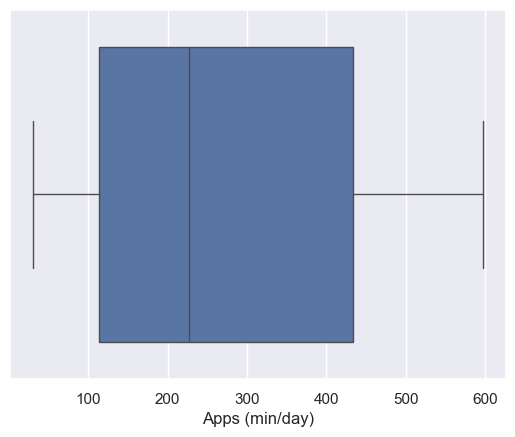
    


```python
sns.boxplot(x=df['# of Apps'])
```


    <Axes: xlabel='# of Apps'>


    
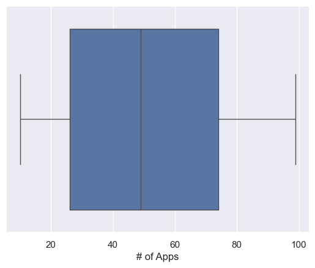
    


```python
sns.boxplot(x=df['Data Usage (MB/day)'])
```


    <Axes: xlabel='Data Usage (MB/day)'>


    
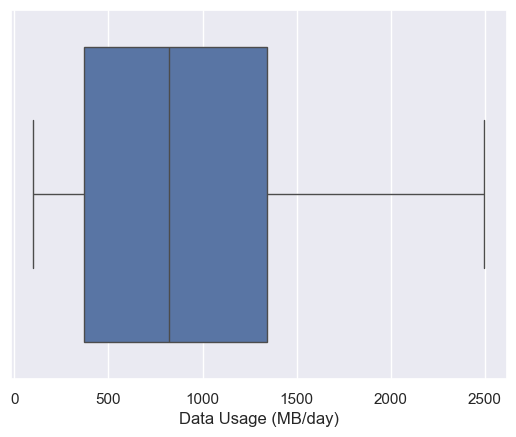
    


```python
sns.boxplot(x=df['Age'])
```


    <Axes: xlabel='Age'>


    
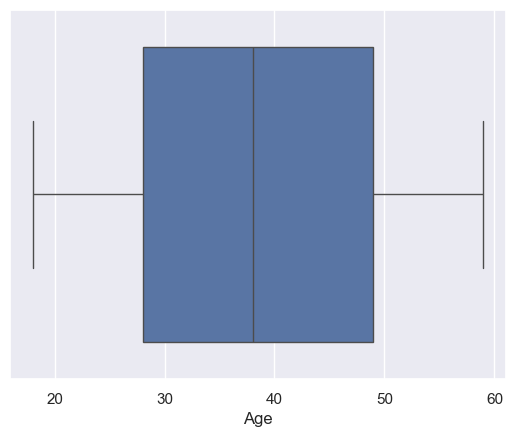
    


```python
# Select only numeric columns
numeric_df = df.select_dtypes(include=['number'])

# what if we try using the z-score?
Q1 = numeric_df.quantile(0.25)
Q3 = numeric_df.quantile(0.75)
IQR = Q3 - Q1
print(IQR)
```

    Apps (min/day)              321.00
    Screen Time (hours/day)       4.90
    Battery Drain (mAh/day)    1507.25
    # of Apps                    48.00
    Data Usage (MB/day)         968.00
    Age                          21.00
    User Level                    2.00
    dtype: float64
    

Don't worry about the above values because it's not important to know each and every one of them because it's just important to know how to use this technique in order to remove the outliers.


```python
ndf = numeric_df[~((numeric_df < (Q1 - 1.5 * IQR)) |(numeric_df > (Q3 + 1.5 * IQR))).any(axis=1)]
ndf.shape
```


    (700, 7)


---


## 9. Plot different features against one another (scatter), against frequency (histogram)

### Histogram

Histogram refers to the frequency of occurrence of variables in an interval. In this case, there are mainly 10 different types of cell phone companies, but it is often important to know who has the most number of phones. To do this histogram is one of the trivial solutions which lets us know the total number of cell phones manufactured by a different company.


```python
df.Model.value_counts().nlargest(40).plot(kind='bar', figsize=(10,5))
plt.title("Number of phones by model")
plt.ylabel('Number of cell phones')
plt.xlabel('Model');
```


    
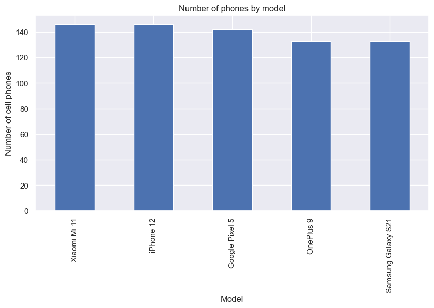
    


### Heat Maps

Heat Maps is a type of plot which is necessary when we need to find the dependent variables. One of the best way to find the relationship between the features can be done using heat maps. In the below heat map we know that the Age feature depends mainly on the ... .


```python
plt.figure(figsize=(10,5))
c= ndf.corr()
sns.heatmap(c,cmap="BrBG",annot=True)
c
```


<div>
<style scoped>
    .dataframe tbody tr th:only-of-type {
        vertical-align: middle;
    }

    .dataframe tbody tr th {
        vertical-align: top;
    }

    .dataframe thead th {
        text-align: right;
    }
</style>
<table border="1" class="dataframe">
  <thead>
    <tr style="text-align: right;">
      <th></th>
      <th>Apps (min/day)</th>
      <th>Screen Time (hours/day)</th>
      <th>Battery Drain (mAh/day)</th>
      <th># of Apps</th>
      <th>Data Usage (MB/day)</th>
      <th>Age</th>
      <th>User Level</th>
    </tr>
  </thead>
  <tbody>
    <tr>
      <th>Apps (min/day)</th>
      <td>1.000000</td>
      <td>0.950333</td>
      <td>0.956385</td>
      <td>0.955253</td>
      <td>0.942308</td>
      <td>0.004382</td>
      <td>0.970498</td>
    </tr>
    <tr>
      <th>Screen Time (hours/day)</th>
      <td>0.950333</td>
      <td>1.000000</td>
      <td>0.948983</td>
      <td>0.946975</td>
      <td>0.941322</td>
      <td>0.017232</td>
      <td>0.964581</td>
    </tr>
    <tr>
      <th>Battery Drain (mAh/day)</th>
      <td>0.956385</td>
      <td>0.948983</td>
      <td>1.000000</td>
      <td>0.961853</td>
      <td>0.932276</td>
      <td>-0.002722</td>
      <td>0.978587</td>
    </tr>
    <tr>
      <th># of Apps</th>
      <td>0.955253</td>
      <td>0.946975</td>
      <td>0.961853</td>
      <td>1.000000</td>
      <td>0.934800</td>
      <td>0.004034</td>
      <td>0.981255</td>
    </tr>
    <tr>
      <th>Data Usage (MB/day)</th>
      <td>0.942308</td>
      <td>0.941322</td>
      <td>0.932276</td>
      <td>0.934800</td>
      <td>1.000000</td>
      <td>0.003999</td>
      <td>0.946734</td>
    </tr>
    <tr>
      <th>Age</th>
      <td>0.004382</td>
      <td>0.017232</td>
      <td>-0.002722</td>
      <td>0.004034</td>
      <td>0.003999</td>
      <td>1.000000</td>
      <td>-0.000563</td>
    </tr>
    <tr>
      <th>User Level</th>
      <td>0.970498</td>
      <td>0.964581</td>
      <td>0.978587</td>
      <td>0.981255</td>
      <td>0.946734</td>
      <td>-0.000563</td>
      <td>1.000000</td>
    </tr>
  </tbody>
</table>
</div>


    
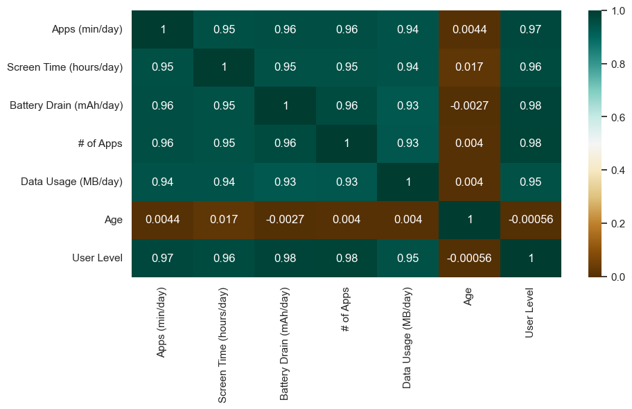
    


### Scatterplot

We generally use scatter plots to find the correlation between two variables. Here the scatter plots are plotted between Screen Time (hours/day) and Apps (min/day) and we can see the plot below. With the plot given below, we can easily draw a trend line. These features provide a good scattering of points.


```python
fig, ax = plt.subplots(figsize=(10,6))
ax.scatter(df['Screen Time (hours/day)'], df['Apps (min/day)'])
ax.set_xlabel('Screen Time (hours/day)')
ax.set_ylabel('Apps (min/day)')
plt.show()
```


    
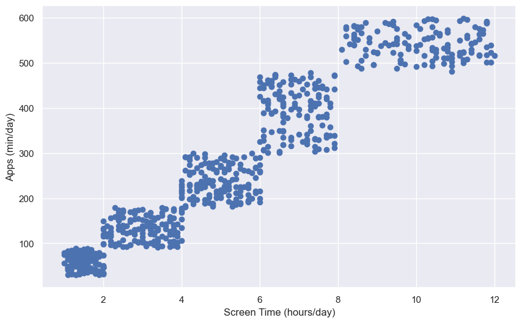
    


**Hence the above are some of the steps involved in Exploratory data analysis, these are some general steps that you must follow in order to perform EDA. There are many more yet to come but for now, this is more than enough idea as to how to perform a good EDA given any data sets. Stay tuned for more updates.**

## Thank you.


---


# Q: Do men or women install more apps on their phones?

### Description:
This bar chart compares the average number of apps installed by men and women. It helps us see who tends to use their phones for more apps.


```python
# Average number of apps installed by gender
gender_apps = df.groupby('Sex')['# of Apps'].mean()
gender_apps.plot(kind='bar', color=['blue', 'pink'], figsize=(8, 6))
plt.title('Average Number of Apps Installed by Gender')
plt.ylabel('Number of Apps Installed')
plt.show()
```


    
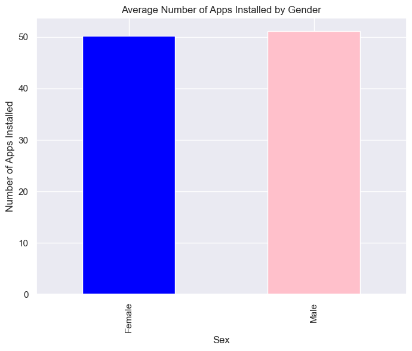
    


---


# Q: Who spends more time on their phone screens: men or women?

### Description: 
This chart shows the average number of hours men and women keep their screens on each day. It gives an idea of who might be more "screen-heavy."


```python
# Average screen time by gender
gender_screen_time = df.groupby('Sex')['Screen Time (hours/day)'].mean()
gender_screen_time.plot(kind='bar', color=['blue', 'pink'], figsize=(8, 6))
plt.title('Average Screen Time by Gender')
plt.ylabel('Screen Time (hours/day)')
plt.show()
```


    
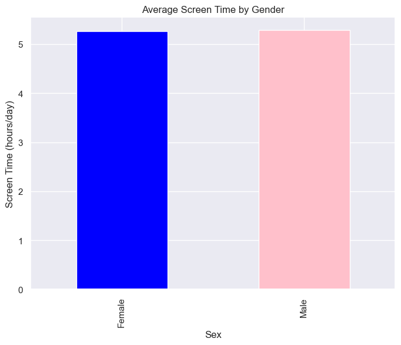
    


---


# Q: Who spends more time using apps: men or women?

### Description:
This visualization looks at the time spent actively using apps each day, comparing men and women. It helps us see who might rely more on apps for activities.


```python
# Average app usage time by gender
gender_app_usage = df.groupby('Sex')['Apps (min/day)'].mean()
gender_app_usage.plot(kind='bar', color=['blue', 'pink'], figsize=(8, 6))
plt.title('Average App Usage Time by Gender')
plt.ylabel('App Usage Time (min/day)')
plt.show()
```


    

    


---


# Q: Does age affect how much battery men and women use?

### Description:
This scatter plot shows how battery drain changes as men and women get older. It helps us understand if younger or older users consume more battery.


```python
# Age vs Battery Drain (Men and Women)
plt.figure(figsize=(8, 6))
plt.scatter(df[df['Sex'] == 'Male']['Age'], 
            df[df['Sex'] == 'Male']['Battery Drain (mAh/day)'], 
            alpha=0.7, label='Men', color='blue')

plt.scatter(df[df['Sex'] == 'Female']['Age'], 
            df[df['Sex'] == 'Female']['Battery Drain (mAh/day)'], 
            alpha=0.7, label='Women', color='pink')

plt.title('Age vs. Battery Drain by Gender')
plt.xlabel('Age')
plt.ylabel('Battery Drain (mAh/day)')
plt.legend()
plt.show()
```


    
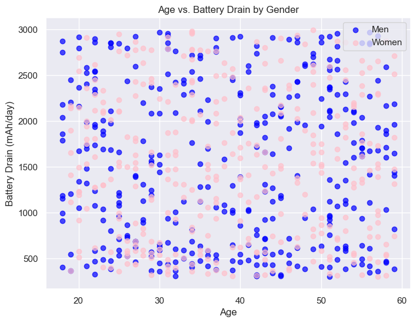
    


---


```python
# Average usage metrics by gender
average_usage = df.groupby('Sex')[['Apps (min/day)', 'Screen Time (hours/day)', 'Battery Drain (mAh/day)']].mean()
print(average_usage)
```

            Apps (min/day)  Screen Time (hours/day)  Battery Drain (mAh/day)
    Sex                                                                     
    Female      271.967262                 5.261310              1519.815476
    Male        270.354396                 5.283242              1530.090659
    


---


# Q: Who uses their phone excessively based on specific thresholds?

### Description:
This bar chart identifies men and women who use their phones for more than 5 hours of screen time, 300 minutes of app usage, and 1500 mAh of battery drain per day. It highlights which gender has more "heavy users."


```python
# Define excessive usage thresholds
excessive_users = df[(df['Apps (min/day)'] > 300) & 
                       (df['Screen Time (hours/day)'] > 5) & 
                       (df['Battery Drain (mAh/day)'] > 1500)]

excessive_count = excessive_users['Sex'].value_counts()
excessive_count.plot(kind='bar', color=['blue', 'pink'], figsize=(8, 6))
plt.title('Excessive Phone Users by Gender')
plt.ylabel('Count')
plt.show()
```


    
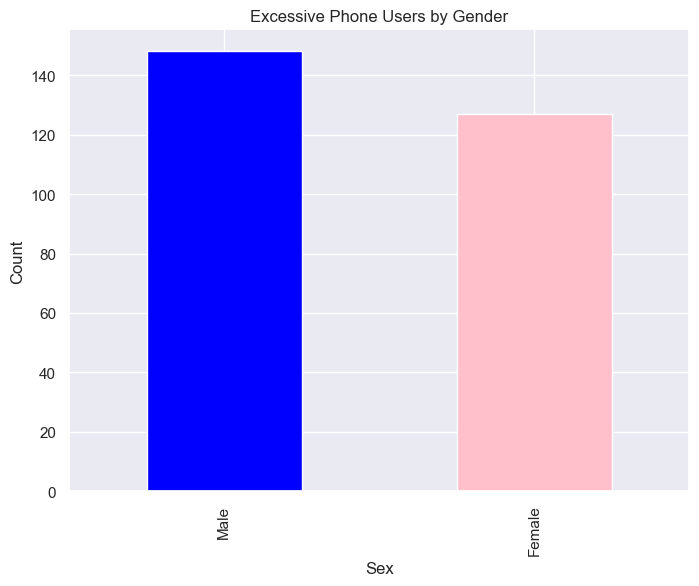
    


---


# Q: Which operating system (Android or iOS) is more popular among men and women?

### Description:
This stacked bar chart shows how many men and women use Android or iOS. It highlights the preferences of each gender.


```python
# OS prevalence by gender
os_gender = df.groupby(['OS', 'Sex']).size().unstack()
os_gender.plot(kind='bar', stacked=True, figsize=(10, 6), color=['blue', 'pink'])
plt.title('Operating System Prevalence by Gender')
plt.ylabel('Count')
plt.show()
```


    
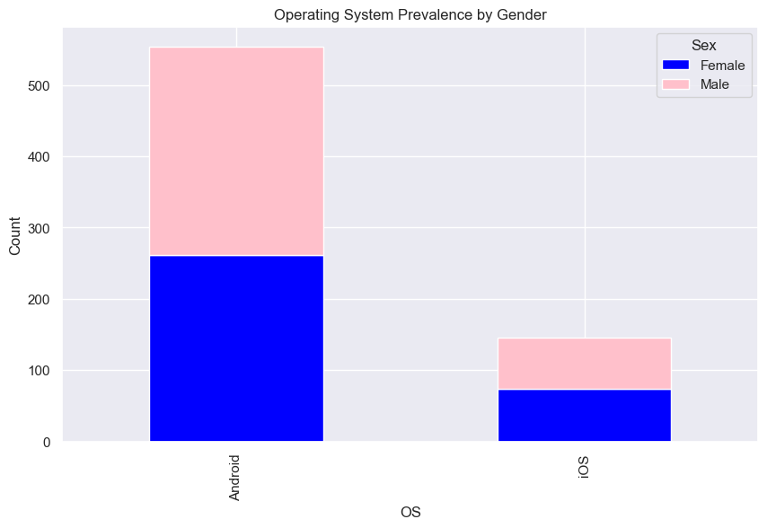
    


---


# Q: Does the type of operating system affect phone usage time?

### Description:
This bar chart compares the average screen time and app usage time (converted to hours) for Android and iOS users. It helps us see which OS might encourage less phone time.


```python
# Convert App Usage Time from minutes to hours
df['App Usage Time (hours/day)'] = df['Apps (min/day)'] / 60

# Group by Operating System and calculate mean values for Screen Time and App Usage Time
os_efficiency = df.groupby('OS')[['Screen Time (hours/day)', 'App Usage Time (hours/day)']].mean()

# Plot the comparison
os_efficiency.plot(kind='bar', figsize=(10, 6))
plt.title('Operating System Efficiency: Screen Time vs App Usage Time (in Hours)')
plt.ylabel('Average Usage Time (hours/day)')
plt.legend(['Screen Time (hours/day)', 'App Usage Time (hours/day)'])
plt.xticks(rotation=0)
plt.show()

```


    
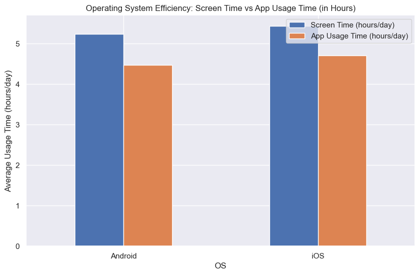
    

